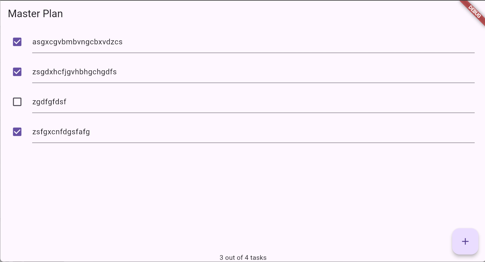

# Laporan Praktikum

## Identitas
- **Mata Kuliah**: Pemrograman Mobile
- **Program Studi**: Teknik Informatika
- **Semester**: 5
- **Nama**: Vincentius Leonanda Prabowo
- **NIM**: 2341720149
- **Kelas**: TI-3D

---

## Praktikum 1

## Tugas Praktikum 1
2. data_layer.dart digunakan sebagai penghubung, jika tidak ada file tersebut setiap model harus mengimportnya modelnya satu persatu, namun lewat data_layer.dart hanya perlu mengimpoertkan file ini

3. Perlu Variable plan karena sebagai sumber data untuk menampilkan daftar task dan memodifikasi task yang dimiliki pengguna. Dan dibuat konstanta karena objek awal Plan bersifat statis, efisien, immutable, dan aman digunakan sebagai nilai awal sebelum ada perubahan dari user.

5. Langkah 11 menginisialisasi ScrollController, menambahkan listener agar keyboard menutup saat user scroll. Dipanggil sekali saat widget dibuat. Langkah 13 membersihkan controller dan resource yang dipakai agar tidak terjadi memory leak. Dipanggil saat widget dihapus.

## Praktikum 2

## Tugas Praktikum 2
2. Pada langkah 1, InheritedWidget yang dimaksud adalah kelas PlanProvider itu sendiri, karena kelas tersebut mewarisi sifat dari InheritedNotifier, yang merupakan turunan dari InheritedWidget. Di Flutter, InheritedWidget digunakan untuk membagikan data ke seluruh widget turunan tanpa harus mengoper nilai secara manual melalui constructor, sehingga widget pada level bawah dapat mengakses data yang sama dan otomatis rebuild ketika data berubah. Pada kasus ini, dipilih InheritedNotifier karena selain berfungsi sebagai InheritedWidget, ia juga terhubung dengan ValueNotifier, sehingga setiap kali nilai di dalam ValueNotifier<Plan> berubah, InheritedNotifier akan memberi tahu seluruh widget turunannya untuk rebuild secara otomatis. Dengan kata lain, InheritedWidget menyediakan mekanisme berbagi data, sementara InheritedNotifier menambahkan kemampuan pemberitahuan perubahan state, sehingga membuatnya lebih efisien dan cocok untuk memantau perubahan pada objek Plan.

3. Method pada langkah 3 tersebut berfungsi untuk menghitung jumlah tugas yang sudah selesai dan membuat pesan ringkas tentang tingkat penyelesaian rencana. Getter completedCount bekerja dengan memfilter daftar tasks menggunakan .where((task) => task.complete), yaitu memilih hanya task yang ditandai selesai, kemudian mengambil .length-nya. Hal ini dilakukan agar jumlah tugas selesai selalu dihitung secara dinamis berdasarkan kondisi terbaru daftar tugas. Getter kedua, completenessMessage, menyusun string seperti "3 out of 5 tasks" dengan menggunakan nilai dari completedCount dan total task. Cara ini dipilih karena getter memungkinkan hasil selalu up-to-date tanpa menyimpan nilai secara terpisah, sehingga tidak ada risiko data tidak sinkron dan UI selalu menampilkan status penyelesaian yang benar.

4. 
