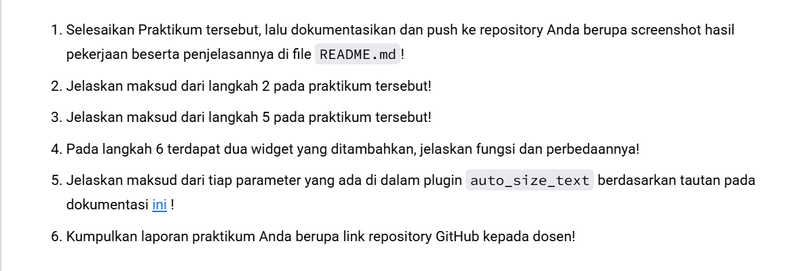
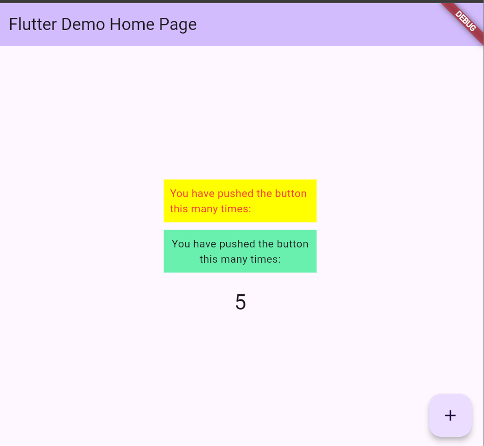
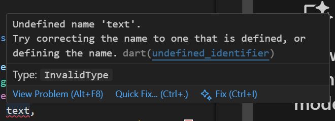
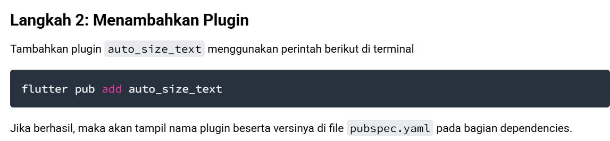
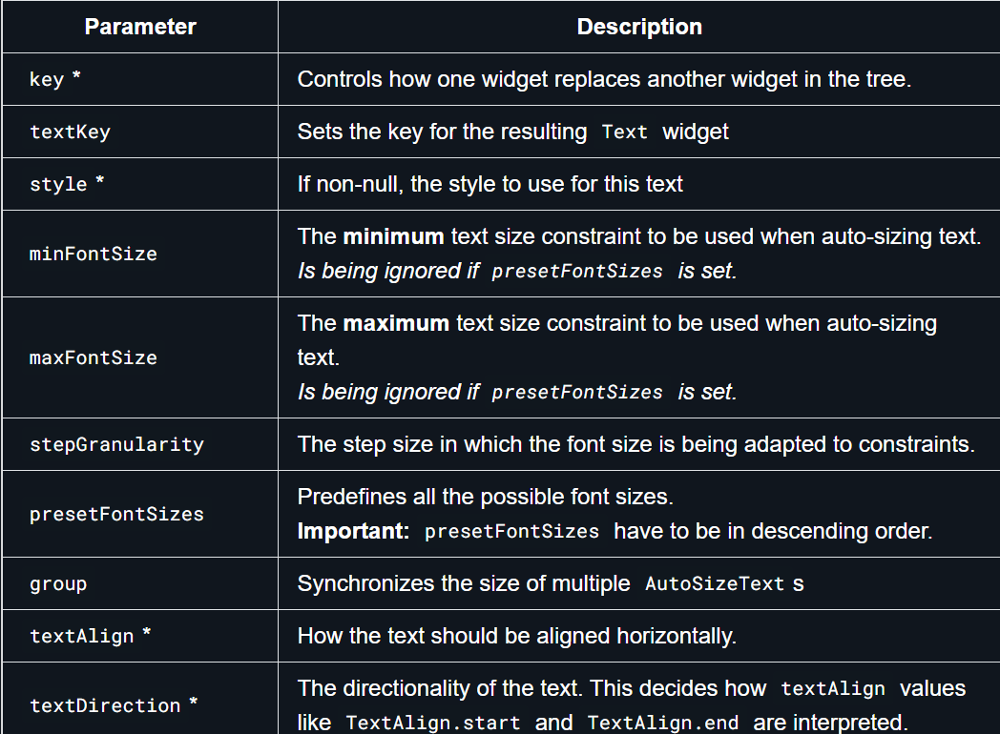
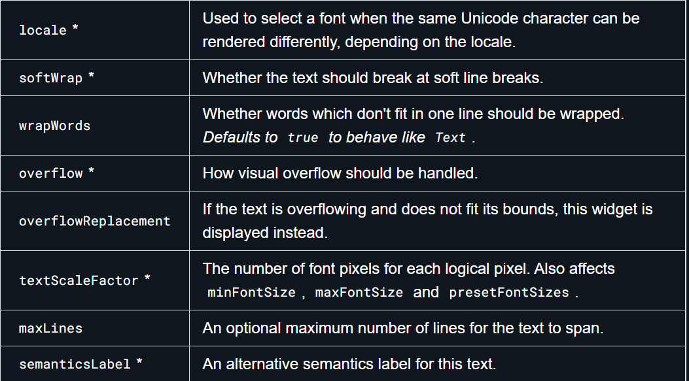

# Laporan Praktikum

## Identitas
- **Mata Kuliah**: Pemrograman Mobile
- **Program Studi**: Teknik Informatika
- **Semester**: 5
- **Nama**: Vincentius Leonanda Prabowo
- **NIM**: 2341720149
- **Kelas**: TI-3D

---
## Praktikum

1. Hasil Praktikum  

 
--Pertanyaan-- 
 
 
eror tersebut dikarenakan text belum di inisiasi

2. Langkah 2 merupakan cara cepat untuk menambah plugin

3. Membuat variabel text dan parameter di constructor dalam sebuah class Flutter (seperti RedTextWidget).

4. Pada Widget yang pertama , menggunakan auto size text yang akan membuat text menyesuaikan.Sedangkan pada container ke 2 menggunakan text biasa yang membuat text tidak menyesuaikan tempatnya

5. Parameter pada auto size text 

